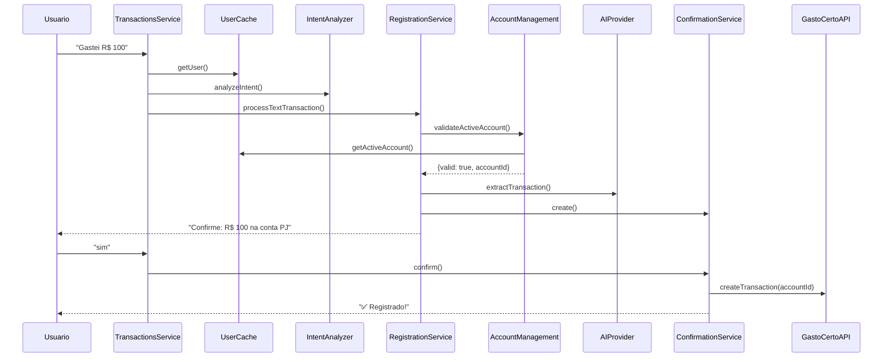
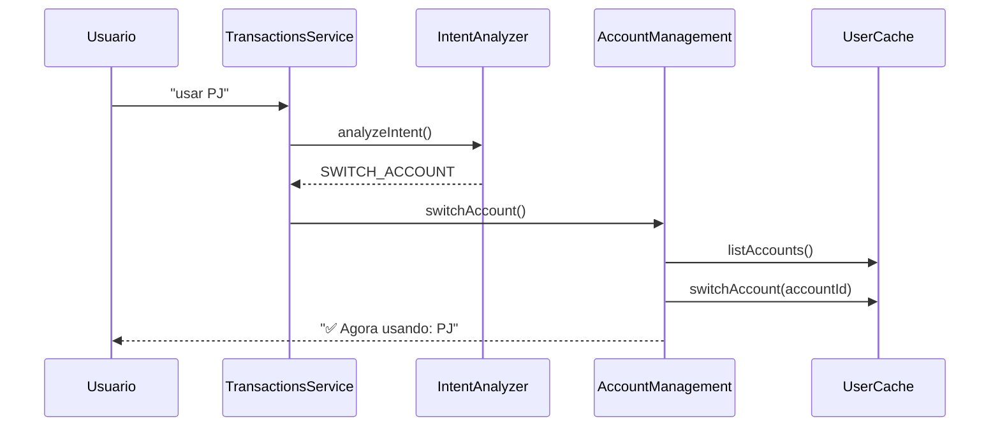

# 📋 Status de Implementação - Sistema Multi-Contas

## ✅ O que já está PRONTO

### 1. **AccountManagementService** (340 linhas)
Gerenciamento centralizado de contas do usuário.

**Funcionalidades:**
- ✅ Listar todas as contas do usuário
- ✅ Mostrar conta ativa atual
- ✅ Trocar conta por nome/tipo ("usar PJ", "usar Pessoal")
- ✅ Menu interativo com seleção numérica (1, 2, 3)
- ✅ Validação de conta ativa antes de operações

**Métodos principais:**
```typescript
listUserAccounts(phoneNumber)      // Lista com indicadores ✅/⚪
showActiveAccount(phoneNumber)      // Mostra qual está ativa
switchAccount(phoneNumber, text)    // Troca por nome/tipo
selectAccountByNumber(phone, num)   // Troca por número
validateActiveAccount(phoneNumber)  // Valida antes de operar
```

---

### 2. **Validação em Todos os Contextos**

#### TransactionRegistrationService
- ✅ Validação antes de processar texto
- ✅ Validação antes de processar imagem
- ✅ Validação herdada em áudio (via texto)
- ✅ Usa conta ativa do cache (não "default")
- ✅ Remove método obsoleto `getDefaultAccountId()`

#### TransactionListingService
- ✅ Validação antes de listar transações
- ✅ Bloqueia listagem sem conta ativa

#### TransactionPaymentService
- ✅ Validação antes de processar pagamentos
- ✅ Bloqueia pagamentos sem conta ativa

---

### 3. **Intents de Conta**

Configurados no `IntentAnalyzerService`:

| Intent | Keywords | Exemplos |
|--------|----------|----------|
| `LIST_ACCOUNTS` | minhas contas, listar contas | "minhas contas", "mostrar contas" |
| `SHOW_ACTIVE_ACCOUNT` | conta ativa, qual conta | "qual conta?", "conta ativa" |
| `SWITCH_ACCOUNT` | mudar conta, trocar conta, usar | "mudar conta", "usar PJ" |

---

### 4. **Fluxo de Seleção Interativa**

**Quando usuário digita:** `"mudar conta"`

1. Sistema lista contas com números:
```
🏦 *Selecione a conta:*

✅ 1. *Pessoal* (PERSONAL) 🌟
⚪ 2. *PJ* (BUSINESS)

💡 Digite o número ou nome da conta
```

2. Usuário responde: `"2"` ou `"PJ"`

3. Sistema detecta seleção numérica e troca conta:
```typescript
// Em TransactionsService.processTextMessage
const isNumericSelection = /^[0-9]$/.test(trimmedText);
if (isNumericSelection && accounts.length > 1) {
  return accountManagement.selectAccountByNumber(phoneNumber, trimmedText);
}
```

4. Confirmação:
```
✅ Conta alterada com sucesso!
🏦 Agora usando: *PJ* (BUSINESS)
```

---

### 5. **Arquitetura Limpa**

- ✅ Removido `contextService` (passava platform diretamente)
- ✅ Método `validateAccountBeforeTransaction()` reutilizável
- ✅ Zero duplicação de lógica de validação
- ✅ `processAudioTransaction` → delega para `processTextTransaction` (herda validação)

---

## ⏳ O que FALTA (se precisar)

### 1. **Melhorias Opcionais**

#### A. Filtro por Conta na Listagem
Permitir listar transações de conta específica:
```
"transações da conta PJ"
"despesas da empresa"
```

**Implementação sugerida:**
- Detectar intent `LIST_TRANSACTIONS_BY_ACCOUNT`
- Extrair nome da conta da mensagem
- Passar accountId como filtro

#### B. Dashboard por Conta
Resumos e estatísticas separados por conta:
```
"resumo da conta PJ"
"quanto gastei na empresa esse mês"
```

**Implementação sugerida:**
- Novo método em `TransactionSummaryService`
- `getSummaryByAccount(phoneNumber, accountName, period)`

#### C. Transferência entre Contas
Mover transação de uma conta para outra:
```
"mover transação para conta pessoal"
"transferir última compra para PJ"
```

**Implementação sugerida:**
- Novo intent `TRANSFER_TRANSACTION`
- Método em `AccountManagementService`
- API: `gastoCertoApi.moveTransaction(transactionId, fromAccountId, toAccountId)`

---

### 2. **Testes Automatizados**

Criar testes E2E para:
- [ ] Listar contas
- [ ] Trocar conta
- [ ] Validação bloqueia sem conta ativa
- [ ] Seleção numérica funciona
- [ ] Transações registradas na conta correta

**Exemplo de teste:**
```typescript
describe('AccountManagementService', () => {
  it('deve listar contas do usuário', async () => {
    const result = await service.listUserAccounts('5511999999999');
    expect(result.success).toBe(true);
    expect(result.message).toContain('Suas Contas');
  });

  it('deve trocar conta por nome', async () => {
    const result = await service.switchAccount('5511999999999', 'usar PJ');
    expect(result.success).toBe(true);
    expect(result.message).toContain('PJ');
  });
});
```

---

### 3. **Documentação para Usuários**

Criar guia de uso:

```markdown
# 🏦 Como Gerenciar Suas Contas

## Ver suas contas
Digite: **"minhas contas"**

## Ver qual conta está ativa
Digite: **"conta ativa"**

## Trocar de conta
Digite: **"usar [nome]"** ou **"mudar conta"**

Exemplos:
- "usar PJ"
- "usar Pessoal"
- "mudar conta" (menu interativo)

## Registrar transação
Sempre será na conta ativa!

Digite: **"Gastei R$ 100 no mercado"**
```

---

### 4. **Configurações Avançadas**

#### A. Definir Conta Padrão
Permitir usuário escolher qual conta é padrão:
```
"definir PJ como padrão"
"conta principal: Pessoal"
```

#### B. Ocultar Contas
Esconder contas inativas da listagem:
```
"ocultar conta PJ"
"mostrar apenas ativas"
```

#### C. Atalhos por Conta
Criar prefixos rápidos:
```
"#PJ Gastei R$ 100 no aluguel"
"#Pessoal Gastei R$ 50 no mercado"
```

---

## 🎯 Prioridades para MVP

### 🔥 Crítico (já implementado)
- [x] Listar contas
- [x] Trocar conta
- [x] Validação de conta ativa
- [x] Registro na conta correta

### 🚀 Importante (próximos passos)
- [ ] Testes automatizados
- [ ] Filtro por conta na listagem
- [ ] Documentação de usuário

### 💡 Opcional (futuro)
- [ ] Dashboard por conta
- [ ] Transferência entre contas
- [ ] Configurações avançadas
- [ ] Atalhos

---

## 📊 Métricas de Implementação

| Componente | Status | Linhas | Testes |
|------------|--------|--------|--------|
| AccountManagementService | ✅ | 340 | ⏳ |
| TransactionRegistrationService | ✅ | 783 | ⏳ |
| TransactionListingService | ✅ | 270 | ⏳ |
| TransactionPaymentService | ✅ | 326 | ⏳ |
| IntentAnalyzerService | ✅ | +30 | ⏳ |
| TransactionsService | ✅ | +35 | ⏳ |

**Total de código adicionado:** ~1.784 linhas

---

## 🐛 Possíveis Bugs a Testar

### 1. **Múltiplas trocas rápidas**
**Cenário:** Usuário troca de conta várias vezes seguidas
**Risco:** Cache desatualizado
**Testar:** Trocar 3x seguidas e registrar transação

### 2. **Seleção numérica fora do range**
**Cenário:** Usuário digita "5" mas tem apenas 2 contas
**Esperado:** Mensagem de erro clara
**Testar:** Enviar número maior que quantidade de contas

### 3. **Mensagem só com número em outro contexto**
**Cenário:** Usuário digita "1" sem estar em menu de contas
**Esperado:** Não deve interpretar como seleção de conta
**Testar:** Enviar "1" sem ter visto menu antes

### 4. **Confirmação pendente + troca de conta**
**Cenário:** Transação pendente, usuário troca de conta
**Esperado:** Confirmação ainda válida ou cancelada?
**Testar:** Pendente → trocar conta → confirmar

---

## 🎓 Como o Sistema Funciona

### Fluxo Completo: Registro de Transação



### Fluxo: Trocar Conta



---

## 🚀 Como Continuar Desenvolvendo

### 1. Pegar próxima feature
Escolha uma da seção "O que FALTA"

### 2. Criar branch
```bash
git checkout -b feature/filtro-por-conta
```

### 3. Implementar
Seguir padrão existente (service dedicado, intent, validação)

### 4. Testar
Usar roteiro em `TESTE_MULTICONTAS.md`

### 5. Commit
```bash
git add .
git commit -m "feat: adiciona filtro por conta na listagem"
git push
```

---

## 📞 Suporte

Dúvidas sobre o código? Procure por:
- `AccountManagementService` → gerenciamento de contas
- `validateActiveAccount` → validação antes de operar
- `SWITCH_ACCOUNT` → intent de troca de conta
- `selectAccountByNumber` → seleção numérica

**Logs relevantes:**
```
🏦 [Account] → logs de conta
📋 [Listing] → logs de listagem
💳 [Payment] → logs de pagamento
📝 [Registration] → logs de registro
```
