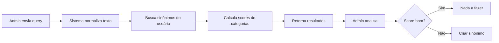

# 🔧 Guia de Integração Admin - Sistema RAG e Sinônimos

> **Documentação completa para integração do painel administrativo com o sistema RAG (Retrieval-Augmented Generation) e gerenciamento de sinônimos.**

---

## 📋 Índice

1. [Visão Geral](#visão-geral)
2. [Conceitos Importantes](#conceitos-importantes)
3. [Endpoints Disponíveis](#endpoints-disponíveis)
4. [Análise RAG sem Logs](#análise-rag-sem-logs)
5. [Gerenciamento de Sinônimos](#gerenciamento-de-sinônimos)
6. [Exemplos de Uso](#exemplos-de-uso)
7. [Fluxo de Integração](#fluxo-de-integração)

---

## 🎯 Visão Geral

O sistema RAG utiliza técnicas de processamento de linguagem natural (NLP) para categorizar automaticamente transações financeiras baseado em mensagens de texto dos usuários.

**Principais funcionalidades:**
- ✅ Análise de matching RAG sem criar logs no banco
- ✅ Visualização de scores de todas as categorias avaliadas
- ✅ Criação de sinônimos globais (aplicados a todos usuários)
- ✅ Criação de sinônimos por usuário específico
- ✅ Listagem de logs históricos de tentativas RAG
- ✅ Análise de sinônimos existentes por usuário

---

## 🔑 Conceitos Importantes

### 1. **userId vs gastoCertoId**

O sistema utiliza dois identificadores:

- **`userId`** (PK do `userCache`): ID usado para lookup rápido no cache Redis
- **`gastoCertoId`**: ID do usuário no sistema principal Gasto Certo

**⚠️ IMPORTANTE:** Os endpoints admin sempre recebem `userId` (PK do userCache), mas internamente convertem para `gastoCertoId` ao buscar dados.

```typescript
// Exemplo de conversão interna
const userCache = await prisma.userCache.findUnique({
  where: { id: userId }, // userId é a PK
  select: { gastoCertoId: true }
});

// Agora usa gastoCertoId para buscar dados RAG
const logs = await prisma.rAGSearchLog.findMany({
  where: { userId: userCache.gastoCertoId }
});
```

### 2. **Sinônimos Globais vs Por Usuário**

| Tipo | Aplicação | Uso |
|------|-----------|-----|
| **Global** | Todos os usuários | Termos técnicos comuns (ex: "DAS", "INSS", "Uber") |
| **Por Usuário** | Usuário específico | Gírias, apelidos, termos regionais (ex: "mercadinho da esquina") |

Sinônimos globais são criados com `userId = 'GLOBAL'` no banco.

### 3. **Score e Threshold**

- **Score**: Confiança do matching (0.0 a 1.0)
- **Threshold padrão**: 0.3 (30%)
- **Score alto (>0.7)**: Match muito confiável
- **Score médio (0.3-0.7)**: Match aceitável, pode precisar confirmação
- **Score baixo (<0.3)**: Não considerado um match válido

---

## 🔌 Endpoints Disponíveis

Base URL: `https://api.gastocerto.com.br` (ou sua URL de produção)

### 1. Testar Matching RAG (SEM criar logs)

**Endpoint mais importante para análise administrativa**

```http
POST /admin/rag/test-match
Content-Type: application/json

{
  "userId": "cache_user_123",
  "query": "gastei no mercado"
}
```

**Resposta:**
```json
{
  "matches": [
    {
      "categoryId": "cat-1",
      "categoryName": "Alimentação",
      "subCategoryId": "sub-1",
      "subCategoryName": "Supermercado",
      "score": 0.95,
      "matchedTerms": ["mercado", "supermercado"]
    }
  ],
  "suggestions": [
    {
      "type": "partial_match",
      "keyword": "mercadinho",
      "categoryName": "Alimentação",
      "reason": "Termo similar a 'mercado'"
    }
  ],
  "userSynonyms": [
    {
      "keyword": "mercado",
      "categoryId": "cat-1",
      "subCategoryId": "sub-1",
      "confidence": 0.85,
      "usageCount": 12,
      "createdAt": "2026-01-10T10:00:00Z"
    }
  ],
  "debug": {
    "processingTimeMs": 45
  }
}
```

**Campos da resposta:**
- `matches`: Categorias encontradas com score acima do threshold
- `suggestions`: Sugestões de sinônimos que podem ser criados
- `userSynonyms`: Sinônimos personalizados do usuário que foram usados
- `debug`: Informações de performance

---

### 2. Análise Detalhada (Todas Categorias)

**Mostra scores de TODAS as categorias avaliadas**

```http
POST /admin/rag/analyze
Content-Type: application/json

{
  "userId": "cache_user_123",
  "query": "uber para casa"
}
```

**Resposta:**
```json
{
  "query": "uber para casa",
  "queryNormalized": "uber para casa",
  "queryTokens": ["uber", "para", "casa"],
  "categories": [
    {
      "categoryId": "cat-2",
      "categoryName": "Transporte",
      "subCategoryId": "sub-10",
      "subCategoryName": "Aplicativo de Transporte",
      "score": 0.92,
      "matchedTokens": ["uber"],
      "reason": "Match exato com sinônimo global"
    },
    {
      "categoryId": "cat-3",
      "categoryName": "Moradia",
      "subCategoryId": "sub-15",
      "subCategoryName": "Aluguel",
      "score": 0.15,
      "matchedTokens": ["casa"],
      "reason": "Match fraco por token 'casa'"
    },
    {
      "categoryId": "cat-1",
      "categoryName": "Alimentação",
      "score": 0.0,
      "matchedTokens": [],
      "reason": "Sem match"
    }
  ]
}
```

**Útil para:**
- Entender por que uma categoria foi escolhida
- Ver quais outras categorias foram consideradas
- Debug de casos onde o matching errou

---

### 3. Criar Sinônimo Global

**Aplicado a TODOS os usuários do sistema**

```http
POST /admin/rag/synonym/global
Content-Type: application/json

{
  "keyword": "uber",
  "categoryId": "cat-2",
  "subCategoryId": "sub-10"
}
```

**Resposta:**
```json
{
  "message": "Sinônimo global criado com sucesso",
  "synonym": {
    "id": "syn_global_123",
    "userId": "GLOBAL",
    "keyword": "uber",
    "categoryId": "cat-2",
    "subCategoryId": "sub-10",
    "confidence": 1.0,
    "source": "ADMIN_APPROVED"
  }
}
```

**Quando usar sinônimos globais:**
- ✅ Marcas conhecidas (Uber, 99, Netflix)
- ✅ Termos técnicos (DAS, INSS, MEI)
- ✅ Tipos de estabelecimentos comuns (supermercado, farmácia)
- ❌ Gírias locais ou termos pessoais

---

### 4. Criar Sinônimo Por Usuário

**Aplicado apenas ao usuário específico**

```http
POST /admin/rag/synonym/user
Content-Type: application/json

{
  "userId": "cache_user_123",
  "keyword": "mercadinho da esquina",
  "categoryId": "cat-1",
  "subCategoryId": "sub-1"
}
```

**Resposta:**
```json
{
  "message": "Sinônimo criado com sucesso para o usuário",
  "synonym": {
    "id": "syn_user_456",
    "userId": "gc-123456",
    "keyword": "mercadinho da esquina",
    "categoryId": "cat-1",
    "subCategoryId": "sub-1",
    "confidence": 0.9,
    "source": "ADMIN_APPROVED"
  }
}
```

---

### 5. Listar Sinônimos do Usuário

```http
GET /admin/rag/synonyms/{userId}
```

**Exemplo:**
```bash
curl https://api.gastocerto.com.br/admin/rag/synonyms/cache_user_123
```

**Resposta:**
```json
[
  {
    "id": "syn_1",
    "userId": "gc-123456",
    "keyword": "mercado",
    "categoryId": "cat-1",
    "categoryName": "Alimentação",
    "subCategoryId": "sub-1",
    "subCategoryName": "Supermercado",
    "confidence": 0.85,
    "usageCount": 24,
    "source": "AUTO_LEARNED",
    "createdAt": "2026-01-05T10:00:00Z"
  },
  {
    "id": "syn_2",
    "keyword": "posto shell",
    "categoryId": "cat-2",
    "categoryName": "Transporte",
    "subCategoryId": "sub-5",
    "subCategoryName": "Combustível",
    "confidence": 0.95,
    "usageCount": 8,
    "source": "USER_CONFIRMED",
    "createdAt": "2026-01-08T14:30:00Z"
  }
]
```

**Sources possíveis:**
- `AUTO_LEARNED`: Aprendido automaticamente pelo sistema
- `USER_CONFIRMED`: Confirmado pelo usuário
- `AI_SUGGESTED`: Sugerido pela IA
- `ADMIN_APPROVED`: Criado por admin
- `IMPORTED`: Importado de outro sistema

---

### 6. Buscar Logs RAG do Usuário

**Ver histórico de tentativas de categorização**

```http
GET /admin/rag/logs/{userId}?failedOnly=true&limit=20
```

**Parâmetros:**
- `failedOnly`: (opcional) true = apenas falhas
- `limit`: (opcional) quantidade de registros (padrão: 50)

**Resposta:**
```json
[
  {
    "id": "log_789",
    "userId": "gc-123456",
    "query": "paguei pro labore",
    "queryNormalized": "paguei pro labore",
    "matches": [],
    "bestMatch": null,
    "bestScore": null,
    "threshold": 0.3,
    "success": false,
    "ragMode": "bm25",
    "responseTime": 12,
    "createdAt": "2026-01-13T09:15:00Z"
  }
]
```

**Útil para:**
- Identificar queries que não dão match
- Encontrar padrões de termos desconhecidos
- Priorizar criação de sinônimos

---

## 📊 Análise RAG sem Logs

### Por que "sem logs"?

Quando você testa uma query via `/admin/rag/test-match`, o sistema:

✅ Executa todo o processo de matching RAG
✅ Retorna scores e resultados detalhados
❌ **NÃO cria registro na tabela `RAGSearchLog`**

Isso permite testar livremente sem poluir os dados de produção.

### Fluxo de Análise



### Exemplo de Workflow

1. **Testar query problemática:**
```bash
curl -X POST https://api.gastocerto.com.br/admin/rag/test-match \
  -H "Content-Type: application/json" \
  -d '{
    "userId": "cache_user_123",
    "query": "paguei o das"
  }'
```

2. **Resposta mostra score baixo:**
```json
{
  "matches": [],
  "suggestions": [
    {
      "type": "unknown_term",
      "keyword": "das",
      "reason": "Termo não encontrado no vocabulário"
    }
  ]
}
```

3. **Criar sinônimo global:**
```bash
curl -X POST https://api.gastocerto.com.br/admin/rag/synonym/global \
  -H "Content-Type: application/json" \
  -d '{
    "keyword": "das",
    "categoryId": "cat-impostos",
    "subCategoryId": "sub-das"
  }'
```

4. **Testar novamente:**
```bash
# Agora deve retornar score alto para categoria "Impostos"
```

---

## 🎨 Gerenciamento de Sinônimos

### Estratégias de Criação

#### 1. Baseado em Logs de Falha

```javascript
// 1. Buscar logs que falharam
const failedLogs = await fetch(
  '/admin/rag/logs/cache_user_123?failedOnly=true&limit=50'
);

// 2. Agrupar por termo mais comum
const termFrequency = {};
failedLogs.forEach(log => {
  const terms = log.query.split(' ');
  terms.forEach(term => {
    termFrequency[term] = (termFrequency[term] || 0) + 1;
  });
});

// 3. Priorizar termos mais frequentes
// Ex: "das" apareceu 15x → criar sinônimo global
```

#### 2. Baseado em Análise Manual

```javascript
// Admin testa diferentes variações
const testCases = [
  "paguei o uber",
  "uber para casa",
  "corrida de uber"
];

for (const query of testCases) {
  const result = await fetch('/admin/rag/test-match', {
    method: 'POST',
    body: JSON.stringify({
      userId: 'cache_user_123',
      query
    })
  });
  
  // Analisar se scores estão consistentes
  console.log(`Query: ${query}`);
  console.log(`Best score: ${result.matches[0]?.score}`);
}
```

### Decisão: Global vs Por Usuário

| Critério | Global | Por Usuário |
|----------|--------|-------------|
| **Frequência** | Usado por muitos usuários | Específico de um usuário |
| **Clareza** | Termo universalmente entendido | Gíria ou termo local |
| **Exemplos** | "Uber", "DAS", "INSS" | "Mercadinho do seu João" |
| **Manutenção** | Menos sinônimos, mais impacto | Mais sinônimos, menos impacto |

### Boas Práticas

✅ **Faça:**
- Teste antes de criar sinônimos globais
- Use análise detalhada (`/analyze`) para entender scores
- Crie sinônimos globais para marcas e termos técnicos
- Revise logs de falha periodicamente

❌ **Evite:**
- Criar sinônimos globais para termos ambíguos
- Criar sinônimos sem testar antes
- Ignorar o campo `subCategoryId` (ajuda na precisão)

---

## 💡 Exemplos de Uso

### Exemplo 1: Identificar Termo Desconhecido

**Cenário:** Usuários estão mencionando "pro labore" mas o sistema não reconhece.

```bash
# 1. Verificar logs de falha
curl "https://api.gastocerto.com.br/admin/rag/logs/cache_user_123?failedOnly=true" | \
  jq '.[] | select(.query | contains("pro labore"))'

# Resultado: 15 ocorrências de "pro labore" sem match

# 2. Testar matching atual
curl -X POST https://api.gastocerto.com.br/admin/rag/test-match \
  -H "Content-Type: application/json" \
  -d '{
    "userId": "cache_user_123",
    "query": "recebi meu pro labore"
  }'

# Resposta: matches = [] (sem match)

# 3. Criar sinônimo global
curl -X POST https://api.gastocerto.com.br/admin/rag/synonym/global \
  -H "Content-Type: application/json" \
  -d '{
    "keyword": "pro labore",
    "categoryId": "cat-receitas",
    "subCategoryId": "sub-salario"
  }'

# 4. Testar novamente
curl -X POST https://api.gastocerto.com.br/admin/rag/test-match \
  -H "Content-Type: application/json" \
  -d '{
    "userId": "cache_user_123",
    "query": "recebi meu pro labore"
  }'

# Resposta: matches[0].score = 0.95 ✅
```

---

### Exemplo 2: Debug de Categoria Errada

**Cenário:** Sistema categorizou "netflix" como "Entretenimento" mas usuário esperava "Streaming".

```bash
# 1. Análise detalhada
curl -X POST https://api.gastocerto.com.br/admin/rag/analyze \
  -H "Content-Type: application/json" \
  -d '{
    "userId": "cache_user_123",
    "query": "paguei netflix"
  }' | jq '.categories | sort_by(.score) | reverse'

# Resultado mostra:
# - "Entretenimento" (score: 0.72)
# - "Streaming" (score: 0.58)
# - "Internet" (score: 0.25)

# 2. Criar sinônimo mais específico
curl -X POST https://api.gastocerto.com.br/admin/rag/synonym/global \
  -H "Content-Type: application/json" \
  -d '{
    "keyword": "netflix",
    "categoryId": "cat-lazer",
    "subCategoryId": "sub-streaming"
  }'

# Agora "netflix" terá score alto em "Streaming"
```

---

### Exemplo 3: Analisar Sinônimos de Usuário

**Cenário:** Admin quer ver como usuário está usando sinônimos personalizados.

```bash
# 1. Listar todos sinônimos
curl "https://api.gastocerto.com.br/admin/rag/synonyms/cache_user_123" | \
  jq 'sort_by(.usageCount) | reverse | .[:10]'

# Resultado: Top 10 sinônimos mais usados
# [
#   { "keyword": "mercado", "usageCount": 45, ... },
#   { "keyword": "posto", "usageCount": 28, ... },
#   ...
# ]

# 2. Testar um sinônimo específico
curl -X POST https://api.gastocerto.com.br/admin/rag/test-match \
  -H "Content-Type: application/json" \
  -d '{
    "userId": "cache_user_123",
    "query": "fui no mercado"
  }'

# Ver se sinônimo "mercado" está sendo usado corretamente
```

---

## 🔄 Fluxo de Integração

### Integração no Painel Admin

```javascript
// 1. Componente de Análise RAG
class RAGAnalyzer {
  async analyzeUser(userId) {
    // Buscar logs com falha
    const failedLogs = await this.api.get(
      `/admin/rag/logs/${userId}?failedOnly=true&limit=100`
    );
    
    // Agrupar por termo
    const unknownTerms = this.extractUnknownTerms(failedLogs);
    
    // Para cada termo, testar matching
    const analysis = [];
    for (const term of unknownTerms) {
      const result = await this.api.post('/admin/rag/test-match', {
        userId,
        query: term
      });
      
      analysis.push({
        term,
        frequency: unknownTerms[term],
        currentScore: result.matches[0]?.score || 0,
        needsSynonym: result.matches[0]?.score < 0.5
      });
    }
    
    return analysis;
  }
  
  extractUnknownTerms(logs) {
    const terms = {};
    logs.forEach(log => {
      const words = log.query.toLowerCase().split(' ');
      words.forEach(word => {
        if (word.length > 3) { // Ignorar palavras curtas
          terms[word] = (terms[word] || 0) + 1;
        }
      });
    });
    return terms;
  }
}

// 2. Componente de Criação de Sinônimos
class SynonymCreator {
  async createSynonym(data) {
    const { keyword, categoryId, subCategoryId, isGlobal, userId } = data;
    
    // Testar antes de criar
    const testResult = await this.api.post('/admin/rag/test-match', {
      userId: userId || 'cache_test_user',
      query: keyword
    });
    
    if (testResult.matches[0]?.score > 0.7) {
      console.warn('Termo já tem score alto, sinônimo pode não ser necessário');
    }
    
    // Criar sinônimo
    const endpoint = isGlobal 
      ? '/admin/rag/synonym/global'
      : '/admin/rag/synonym/user';
      
    const response = await this.api.post(endpoint, {
      keyword,
      categoryId,
      subCategoryId,
      ...(!isGlobal && { userId })
    });
    
    // Testar novamente para confirmar
    const retest = await this.api.post('/admin/rag/test-match', {
      userId: userId || 'cache_test_user',
      query: keyword
    });
    
    return {
      created: response,
      beforeScore: testResult.matches[0]?.score || 0,
      afterScore: retest.matches[0]?.score || 0
    };
  }
}
```

### Dashboard Sugerido

```
┌─────────────────────────────────────────────┐
│  RAG & Sinônimos - Dashboard Admin         │
├─────────────────────────────────────────────┤
│                                             │
│  📊 Estatísticas Gerais                     │
│  • Total de sinônimos globais: 156         │
│  • Queries com falha (últimos 7d): 234     │
│  • Taxa de sucesso RAG: 87%                │
│                                             │
├─────────────────────────────────────────────┤
│                                             │
│  🔍 Análise por Usuário                     │
│  └─ UserID: [__________] [Analisar]        │
│                                             │
│  Resultados:                                │
│  • Logs de falha: 15                        │
│  • Termos desconhecidos: 8                  │
│  • Sugestões de sinônimos: 5               │
│                                             │
│  Top termos sem match:                      │
│  1. "das" (12x) → [Criar Sinônimo Global]  │
│  2. "pro labore" (8x) → [Criar Sinônimo]   │
│  3. "nfse" (5x) → [Criar Sinônimo Global]  │
│                                             │
├─────────────────────────────────────────────┤
│                                             │
│  ➕ Criar Sinônimo                          │
│  • Keyword: [____________]                  │
│  • Categoria: [▼ Selecionar]               │
│  • Subcategoria: [▼ Selecionar]            │
│  • Tipo: ○ Global  ○ Por Usuário           │
│  [Testar Antes] [Criar]                    │
│                                             │
└─────────────────────────────────────────────┘
```

---

## 📚 Referência Rápida

### Comandos cURL

```bash
# Testar matching
curl -X POST $API/admin/rag/test-match \
  -H "Content-Type: application/json" \
  -d '{"userId":"USER_ID","query":"QUERY"}'

# Análise detalhada
curl -X POST $API/admin/rag/analyze \
  -H "Content-Type: application/json" \
  -d '{"userId":"USER_ID","query":"QUERY"}'

# Criar sinônimo global
curl -X POST $API/admin/rag/synonym/global \
  -H "Content-Type: application/json" \
  -d '{"keyword":"TERM","categoryId":"CAT_ID","subCategoryId":"SUB_ID"}'

# Criar sinônimo por usuário
curl -X POST $API/admin/rag/synonym/user \
  -H "Content-Type: application/json" \
  -d '{"userId":"USER_ID","keyword":"TERM","categoryId":"CAT_ID"}'

# Listar sinônimos
curl $API/admin/rag/synonyms/USER_ID

# Buscar logs
curl "$API/admin/rag/logs/USER_ID?failedOnly=true&limit=50"
```

---

## 🆘 Troubleshooting

### Erro: "Usuário não encontrado no cache"

**Causa:** O `userId` fornecido não existe na tabela `userCache`.

**Solução:**
```bash
# Verificar se usuário existe
SELECT id, gastoCertoId FROM userCache WHERE id = 'USER_ID';
```

### Score sempre baixo mesmo com sinônimo

**Causa:** Podem haver múltiplos tokens na query que diluem o score.

**Solução:**
1. Use `/admin/rag/analyze` para ver quais tokens estão afetando
2. Crie sinônimos para termos compostos
3. Verifique se `subCategoryId` está correto

### Sinônimo global não aparecendo

**Causa:** Cache do RAG pode estar desatualizado.

**Solução:**
```javascript
// O sistema limpa cache automaticamente ao criar sinônimo global
// Mas pode forçar limpeza se necessário
await ragService.clearCache();
```

---

## 📞 Suporte

Para dúvidas ou problemas:
- 📧 Email: dev@gastocerto.com.br
- 📱 Slack: #rag-support

---

**Última atualização:** 13 de Janeiro de 2026
**Versão:** 2.0.0
