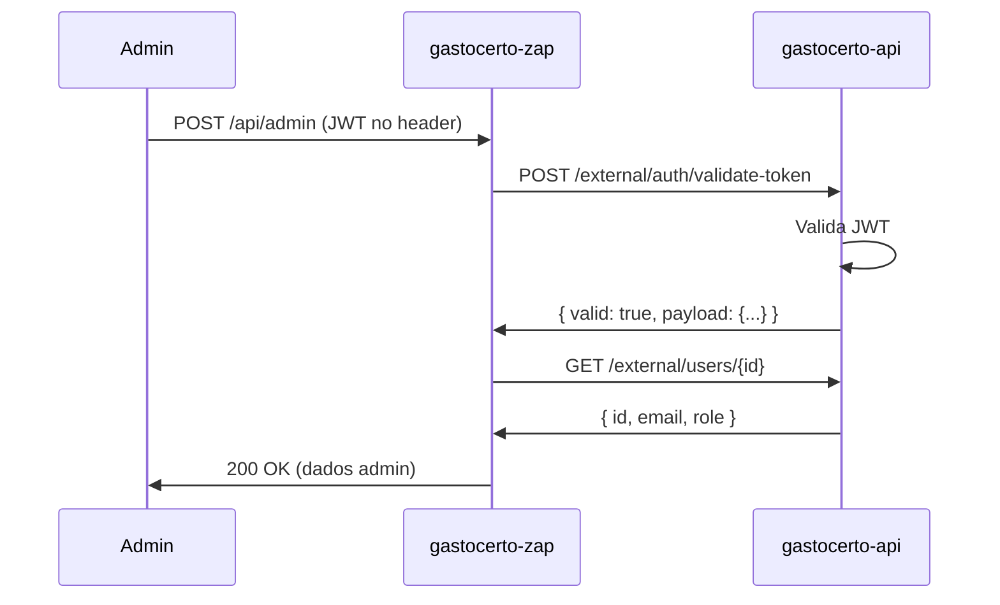

# 🔐 Autenticação com gastocerto-api

## Problema: "Cannot connect to gastocerto-api"

### O que está acontecendo?

O erro ocorre porque o `gastocerto-zap` tenta validar tokens JWT com a API principal (`gastocerto-api`), mas ela não está respondendo.

```
[Nest] ERROR [JwtValidationService] Cannot connect to gastocerto-api
[Nest]  WARN [JwtAuthGuard] Invalid or expired token
```

### Por que acontece?

O sistema valida tokens JWT para autenticação de admins através do endpoint:
```
POST http://localhost:3333/api/external/auth/validate-token
```

Se a `gastocerto-api` não estiver rodando, a validação falha.

---

## ✅ Soluções

### Opção 1: Iniciar a gastocerto-api (RECOMENDADO)

```bash
# Em outro terminal
cd /path/to/gastocerto-api
npm run start:dev
```

A API deve rodar em `http://localhost:3333`

### Opção 2: Modo Development Bypass (Para testes locais)

**⚠️ APENAS PARA DESENVOLVIMENTO - NUNCA EM PRODUÇÃO**

1. Adicione ao seu `.env` local:

```bash
# .env
DEV_AUTH_BYPASS="true"
```

2. Reinicie o servidor:

```bash
npm run start:dev
```

3. Quando ativo, você verá:

```
⚠️  DEV_AUTH_BYPASS enabled - Authentication checks will be skipped!
```

O sistema retornará um usuário admin mock:
```typescript
{
  id: 'dev-user-123',
  email: 'dev@gastocerto.local',
  username: 'dev@gastocerto.local',
  name: 'Dev Admin',
  role: 'ADMIN'
}
```

### Opção 3: Configurar URL da API de Produção

Se você tem acesso à API de produção:

```bash
# .env
GASTO_CERTO_API_URL="https://api.gastocerto.com/api"
```

---

## 🔍 Verificação

### Testar se a API está respondendo:

```bash
curl http://localhost:3333/api/health
```

Deve retornar: `{"status":"ok"}`

### Testar autenticação:

```bash
curl -X POST http://localhost:3333/api/external/auth/validate-token \
  -H "Content-Type: application/json" \
  -d '{"token":"seu-jwt-token"}'
```

---

## 🛡️ Segurança

### ⚠️ IMPORTANTE: Modo Bypass

O modo `DEV_AUTH_BYPASS="true"`:
- ✅ Permite desenvolvimento sem dependências externas
- ✅ Acelera ciclo de desenvolvimento
- ❌ **NUNCA deve ser usado em produção**
- ❌ **Desabilita todas as verificações de segurança**

### Como funciona em produção?



---

## 📝 Configuração Completa

### .env

```bash
# NODE_ENV deve ser 'development' para bypass funcionar
NODE_ENV="development"

# URL da API
GASTO_CERTO_API_URL="http://localhost:3333/api"

# Shared secret para HMAC (service-to-service)
SERVICE_SHARED_SECRET="your-secret-here"

# IDs dos serviços
GASTOCERTO_CERTO_API_SERVICE_ID="gastocerto-api"
GASTOCERTO_ZAP_SERVICE_ID="gastocerto-zap"

# Timeout (5 minutos)
SERVICE_REQUEST_TIMEOUT_MS="300000"

# BYPASS (apenas dev)
DEV_AUTH_BYPASS="false"
```

---

## 🐛 Debugging

### Logs úteis:

**Com bypass ativado:**
```
⚠️  DEV_AUTH_BYPASS enabled - Authentication checks will be skipped!
🔓 DEV_AUTH_BYPASS: Returning mock admin user
```

**Tentando conectar:**
```
Validating JWT token via gastocerto-api
{"url":"http://localhost:3333/api/external/auth/validate-token",...}
```

**Erro de conexão:**
```
❌ Cannot connect to gastocerto-api at http://localhost:3333/api
   💡 Make sure gastocerto-api is running or update GASTO_CERTO_API_URL in .env
```

---

## ❓ FAQ

### 1. Por que não usar JWT local sem API?

A validação centralizada na `gastocerto-api` garante:
- ✅ Revogação imediata de tokens
- ✅ Controle centralizado de usuários
- ✅ Auditoria de acessos
- ✅ Single source of truth

### 2. Como funciona em produção?

Em produção, o `DEV_AUTH_BYPASS` é sempre `false` e a `GASTO_CERTO_API_URL` aponta para a API real.

### 3. Preciso do token real com bypass?

Não. Com bypass ativo, qualquer string no header `Authorization: Bearer xxx` funciona.

### 4. Como testar endpoints protegidos?

**Com API rodando:**
```bash
# 1. Login no gastocerto-api
curl -X POST http://localhost:3333/api/auth/login \
  -H "Content-Type: application/json" \
  -d '{"email":"admin@gastocerto.com","password":"senha"}'

# 2. Usar token retornado
curl http://localhost:3000/api/admin/sessions \
  -H "Authorization: Bearer SEU_TOKEN_AQUI"
```

**Com bypass:**
```bash
curl http://localhost:3000/api/admin/sessions \
  -H "Authorization: Bearer qualquer-coisa"
```

---

## 🔗 Endpoints que requerem autenticação

### Admin:
- `GET /api/admin/*` - Todos endpoints admin
- `POST /api/admin/*` - Ações administrativas

### WebSocket:
- Gateway `/ws` - Conexão WebSocket (via query param `?token=xxx`)

---

## ✅ Checklist de Deploy

Antes de fazer deploy para produção:

- [ ] `NODE_ENV="production"`
- [ ] `DEV_AUTH_BYPASS="false"` (ou removido)
- [ ] `GASTO_CERTO_API_URL` apontando para API de produção
- [ ] `SERVICE_SHARED_SECRET` configurado corretamente
- [ ] Testar autenticação com token real
- [ ] Verificar logs de segurança

---

## 📚 Referências

- Código: `src/common/services/jwt-validation.service.ts`
- Guards: `src/common/guards/jwt-auth.guard.ts`
- Config: `src/core/config/gasto-certo-api.config.ts`
