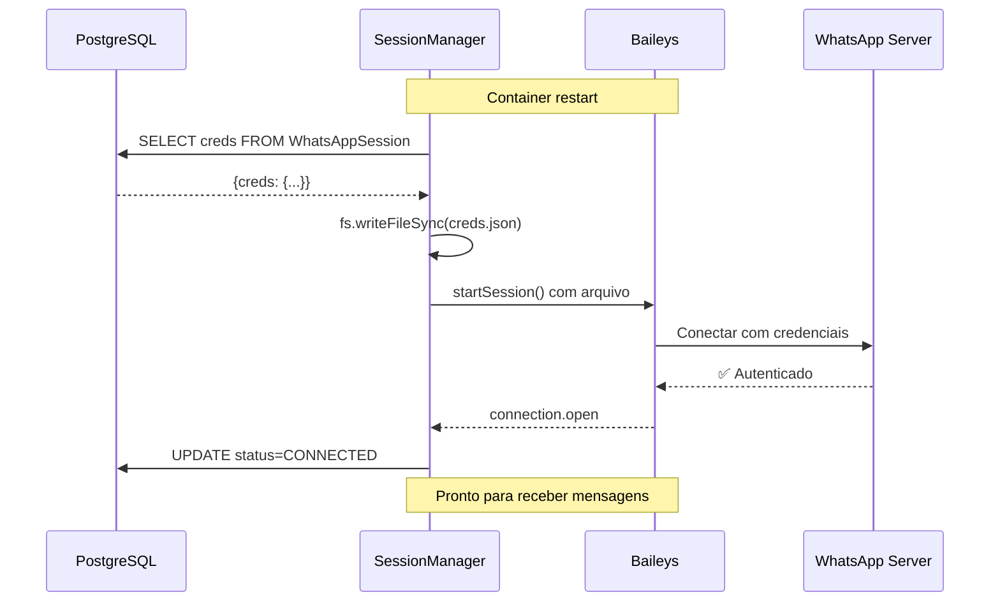

# Persistência de Credenciais para Docker 🐳

## Data: 29/12/2025

## Problema Original

Em ambiente Docker, arquivos locais em `.auth_sessions/` são perdidos quando o container reinicia, causando:
- ❌ Perda de autenticação WhatsApp
- ❌ Necessidade de escanear QR code novamente
- ❌ Sessões não restauradas automaticamente

## Solução Implementada: Sistema Híbrido

### Arquitetura

```
┌─────────────────────────────────────────────────────────────┐
│                    Container Docker                         │
│                                                             │
│  ┌──────────────┐         ┌──────────────┐                │
│  │ PostgreSQL   │◄────────┤ Baileys      │                │
│  │   Database   │         │  WhatsApp    │                │
│  └──────────────┘         └──────────────┘                │
│         ▲                        ▲                          │
│         │                        │                          │
│         │  creds.json           │                          │
│         │  (sincronizado)       │                          │
│         │                        │                          │
│  ┌──────┴────────────────────────┴──────┐                 │
│  │  WhatsAppSessionManager              │                 │
│  │  ┌─────────────────────────────┐     │                 │
│  │  │ saveCredsToDatabase()       │     │                 │
│  │  │ restoreCredsFromDatabase()  │     │                 │
│  │  └─────────────────────────────┘     │                 │
│  └──────────────────────────────────────┘                 │
│         ▲                        ▲                          │
│         │ Restaura               │ Salva                   │
│         │ na startup             │ após auth               │
│         │                        │                          │
│  ┌──────┴────────────────────────┴──────┐                 │
│  │  .auth_sessions/ (temporário)        │                 │
│  │  ├── session-xxx/                    │                 │
│  │  │   ├── creds.json                  │                 │
│  │  │   └── *.json (outros arquivos)    │                 │
│  └──────────────────────────────────────┘                 │
│         Volatil (recriado a cada start)                   │
└─────────────────────────────────────────────────────────────┘
```

## Fluxo Completo

### 1️⃣ Primeira Autenticação

```typescript
// 1. Usuário ativa sessão
POST /whatsapp/:id/activate

// 2. Baileys cria arquivos locais
.auth_sessions/session-xxx/
├── creds.json          ← Criado pelo Baileys
└── *.json              ← Outros arquivos

// 3. Socket event listener captura
sock.ev.on('creds.update', async () => {
  // A. Salvar no arquivo (Baileys precisa)
  await saveCreds();
  
  // B. Sincronizar com banco (Docker persistence)
  await this.saveCredsToDatabase(sessionId);
});

// 4. Banco de dados atualizado
UPDATE WhatsAppSession
SET creds = '{"noiseKey":{"private":"..."},...}'
WHERE sessionId = 'session-xxx';
```

### 2️⃣ Container Reinicia

```typescript
// Container inicia → arquivos .auth_sessions/ vazios

// 1. onModuleInit() executa
async onModuleInit() {
  await this.restoreActiveSessions();
}

// 2. Busca sessões conectadas no banco
const sessions = await prisma.whatsAppSession.findMany({
  where: { 
    status: 'CONNECTED',
    creds: { not: null }  // ← Tem credenciais
  }
});

// 3. Para cada sessão: Restaurar do banco
for (const session of sessions) {
  // A. Ler creds do banco
  const { creds } = await prisma.whatsAppSession.findUnique({
    where: { sessionId }
  });

  // B. Criar arquivo local temporário
  fs.writeFileSync('.auth_sessions/session-xxx/creds.json', 
    JSON.stringify(creds)
  );

  // C. Iniciar sessão usando arquivo restaurado
  await startSession(sessionId);
  // ✅ Baileys conecta sem QR code!
}
```

### 3️⃣ Sessão Ativa



## Código Implementado

### saveCredsToDatabase()

```typescript
private async saveCredsToDatabase(sessionId: string): Promise<void> {
  const authDir = this.getAuthDir(sessionId);
  const credsPath = path.join(authDir, 'creds.json');

  // Ler do arquivo local
  const credsContent = fs.readFileSync(credsPath, 'utf-8');
  const creds = JSON.parse(credsContent);

  // Salvar no banco
  await this.prisma.whatsAppSession.update({
    where: { sessionId },
    data: { creds },
  });

  this.logger.log(`💾 Credentials saved to database for session: ${sessionId}`);
}
```

### restoreCredsFromDatabase()

```typescript
private async restoreCredsFromDatabase(sessionId: string): Promise<boolean> {
  // Buscar do banco
  const session = await this.prisma.whatsAppSession.findUnique({
    where: { sessionId },
    select: { creds: true },
  });

  if (!session?.creds) return false;

  // Criar diretório
  const authDir = this.getAuthDir(sessionId);
  fs.mkdirSync(authDir, { recursive: true });

  // Escrever arquivo
  const credsPath = path.join(authDir, 'creds.json');
  fs.writeFileSync(credsPath, JSON.stringify(session.creds, null, 2));

  this.logger.log(`📥 Credentials restored from database for session: ${sessionId}`);
  return true;
}
```

## Schema Prisma

```prisma
model WhatsAppSession {
  id            String        @id @default(uuid())
  sessionId     String        @unique
  name          String
  phoneNumber   String?
  status        SessionStatus @default(DISCONNECTED)
  isActive      Boolean       @default(false)
  
  // 🔑 PERSISTÊNCIA DOCKER
  creds         Json?         // Credenciais Baileys (sincronizado)
  
  lastConnected DateTime?
  createdAt     DateTime      @default(now())
  updatedAt     DateTime      @updatedAt
}
```

## Comparação: Antes vs Depois

| Aspecto | ❌ Antes | ✅ Agora |
|---------|----------|----------|
| **Restart Docker** | Perde sessões | Restaura automaticamente |
| **Credenciais** | Apenas arquivos | Banco + Arquivos |
| **QR Code** | Toda vez | Apenas 1ª vez |
| **Múltiplas sessões** | ⚠️ Frágil | ✅ Robusto |
| **Backup** | Manual | Automático (banco) |
| **Escalabilidade** | 1 instância | Multi-instância (com banco compartilhado) |

## Logs de Sucesso

### Primeira Autenticação
```
📱 QR Code generated for session: session-xxx
✅ Session session-xxx connected successfully!
   📱 ID: 5566996285154:14@s.whatsapp.net
   👤 Name: WhatsApp
💾 Credentials saved to database for session: session-xxx
```

### Restart do Container
```
🔄 Restoring active sessions from database...
📦 Found 2 active sessions to restore
🔌 Restoring session: session-xxx
📥 Credentials restored from database for session: session-xxx
🚀 Starting WhatsApp session: session-xxx
📱 Baileys version: 2.3000.1027934701 (latest: true)
✅ WhatsApp socket initialized for session: session-xxx
✅ Session session-xxx connected successfully!
```

## Vantagens da Solução

### ✅ Docker-Ready
- Arquivos `.auth_sessions/` são **temporários** (podem ser deletados)
- Credenciais **persistem no banco** (independente do container)
- **Auto-restore** funciona após restart

### ✅ Multi-Instância
- Múltiplos containers podem compartilhar mesmo banco
- Cada container restaura suas sessões do banco
- Coordenação via banco de dados

### ✅ Backup Automático
- Credenciais no banco = backup automático
- `pg_dump` inclui credenciais
- Disaster recovery facilitado

### ✅ Compatível com Baileys
- Baileys **ainda usa arquivos** (necessário)
- Sincronização transparente
- Sem hacks ou modificações no Baileys

## Volume Docker (Opcional)

Se quiser evitar sincronização, pode usar volume:

```yaml
# docker-compose.yml
services:
  zap-service:
    volumes:
      - auth_sessions:/app/.auth_sessions  # ← Persiste arquivos

volumes:
  auth_sessions:
```

**Mas com sincronização do banco, isso é opcional!**

## Teste Manual

```bash
# 1. Conectar primeira vez
curl -X POST http://localhost:4444/whatsapp/:id/activate

# 2. Escanear QR
# Aguardar log: 💾 Credentials saved to database

# 3. Verificar banco
SELECT sessionId, status, creds IS NOT NULL as has_creds 
FROM "WhatsAppSession";

# 4. Reiniciar container
docker restart zap-service

# 5. Verificar logs
# Deve aparecer: 📥 Credentials restored from database

# 6. Enviar mensagem
# ✅ Deve funcionar sem escanear QR novamente!
```

## Resumo

| Componente | Função |
|------------|--------|
| **Banco** | Armazena credenciais (persistente) |
| **Arquivo** | Usado pelo Baileys (temporário) |
| **Sincronização** | Banco ↔ Arquivo (automática) |
| **Auto-restore** | Restaura do banco ao iniciar |

**Sistema pronto para produção em Docker!** 🚀🐳
