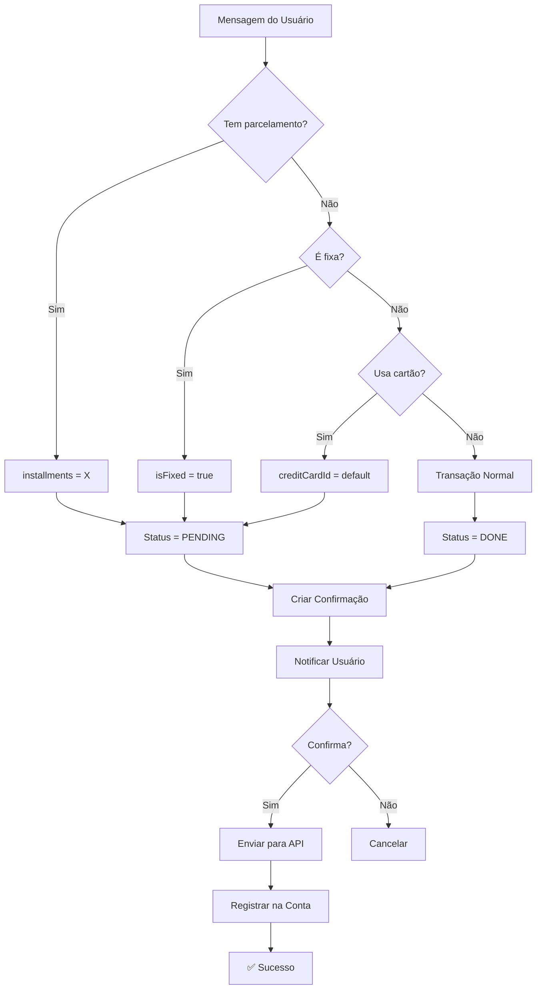

# 🎯 Plano de Implementação - Transações Avançadas

## 📋 Visão Geral

Implementação de funcionalidades avançadas para transações:
- ✅ Transações **Fixas/Recorrentes** (isFixed)
- ✅ Transações **Parceladas** (installments detection)
- ✅ Transações **Pendentes vs Pagas** (status inteligente)
- ✅ **Cartão de crédito default** (similar ao accountId default)
- ✅ **Notificações** ao usuário sobre tipo de transação criada

---

## 🎯 Objetivos

### 1. Detecção Inteligente de Tipo de Transação

| Tipo | Detecção | Status Padrão | Confirmação | Exemplo |
|------|----------|---------------|-------------|---------|
| **Fixa** | Palavras-chave: "todo mês", "mensal", "recorrente", "fixa" | PENDING | **OBRIGATÓRIA** | "Pago aluguel de R$ 1500 todo mês" |
| **Parcelada** | Padrões: "4x", "em 4 vezes", "parcelado em 5", "5 parcelas" | PENDING | **OBRIGATÓRIA** | "Comprei tênis de R$ 320 em 4 vezes" |
| **Cartão de Crédito** | Palavras: "no cartão", "crédito", "credito" | PENDING | **OBRIGATÓRIA** | "Gastei R$ 100 no cartão de crédito" |
| **Normal** | Nenhum dos acima | DONE (paga) | Condicional (confidence) | "Gastei R$ 50 no mercado" |

⚠️ **REGRA CRÍTICA:** Transações fixas, parceladas ou de cartão de crédito **SEMPRE** exigem confirmação do usuário, independente da confidence da IA.

### 2. Combinações de Tipos

É possível combinar diferentes tipos de transação:

| Combinação | Exemplo | Status |
|------------|---------|--------|
| **Fixa + Cartão** | "Pago Netflix de R$ 30 todo mês no cartão" | PENDING |
| **Parcelada + Cartão** | "Comprei notebook de R$ 3000 em 10x no cartão" | PENDING |
| **Fixa + Parcelada** | ❌ Não faz sentido (conflito lógico) | N/A |

### 3. Lógica de Fatura do Cartão de Crédito

Quando uma transação é detectada no cartão de crédito, precisamos determinar **para qual mês** a fatura será lançada:

```
Hoje: 15 de Dezembro de 2025
Fechamento da fatura: Dia 10 de cada mês
Vencimento: Dia 20 de cada mês

→ Se transação for ANTES do dia 10: vai para fatura de DEZEMBRO
→ Se transação for DEPOIS do dia 10: vai para fatura de JANEIRO
```

**Exemplo:**
```
Transação: "Gastei R$ 100 no cartão"
Data: 05/12/2025
Fechamento: 10/12/2025
→ Vai para fatura de DEZEMBRO/2025

Transação: "Gastei R$ 100 no cartão"
Data: 15/12/2025
Fechamento: 10/12/2025
→ Vai para fatura de JANEIRO/2026
```

### 4. Notificações ao Usuário

Avisar claramente ao usuário o tipo de transação criada e suas implicações.

---

## 🔧 Implementação Detalhada

### Fase 1: Estrutura de Dados

#### 1.1. DTOs (Transaction Data Transfer Objects)

**Arquivo:** `src/features/transactions/dto/transaction.dto.ts`

```typescript
export interface TransactionData {
  // Campos existentes
  type: TransactionType;
  amount: number;
  description: string | null;
  date: string;
  category: string;
  subCategory?: string | null;
  merchant?: string | null;
  confidence: number;
  
  // ✨ NOVOS CAMPOS
  isFixed?: boolean;               // Transação recorrente/fixa
  fixedFrequency?: 'MONTHLY' | 'WEEKLY' | 'ANNUAL' | 'BIENNIAL'; // Frequência
  installments?: number;            // Número de parcelas
  installmentNumber?: number;       // Número da parcela atual (1, 2, 3...)
  creditCardId?: string;            // ID do cartão de crédito usado
  paymentStatus?: 'PENDING' | 'DONE'; // Status de pagamento
}
```

#### 1.2. Atualizar CreateTransactionConfirmationDto

```typescript
export class CreateTransactionConfirmationDto {
  // Campos existentes...
  
  @IsBoolean()
  @IsOptional()
  isFixed?: boolean;
  
  @IsString()
  @IsOptional()
  fixedFrequency?: 'MONTHLY' | 'WEEKLY' | 'ANNUAL' | 'BIENNIAL';
  
  @IsNumber()
  @IsOptional()
  installments?: number;
  
  @IsNumber()
  @IsOptional()
  installmentNumber?: number;
  
  @IsString()
  @IsOptional()
  creditCardId?: string;
  
  @IsString()
  @IsOptional()
  paymentStatus?: 'PENDING' | 'DONE';
}
```

#### 1.3. User Cache - Adicionar Cartão Default

**Arquivo:** `src/common/cache/user-cache.service.ts`

```typescript
export interface UserCache {
  // Campos existentes...
  defaultAccountId?: string;  // ✅ Já existe
  
  // ✨ NOVO
  defaultCreditCardId?: string; // Cartão de crédito padrão
}
```

---

### Fase 2: Detecção NLP (Natural Language Processing)

#### 2.1. Criar Serviço de Detecção de Parcelas

**Novo arquivo:** `src/common/services/installment-parser.service.ts`

```typescript
import { Injectable, Logger } from '@nestjs/common';

export interface InstallmentDetectionResult {
  isInstallment: boolean;
  installments?: number;
  confidence: number;
  matchedPattern?: string;
}

@Injectable()
export class InstallmentParserService {
  private readonly logger = new Logger(InstallmentParserService.name);

  /**
   * Padrões para detectar parcelamento
   * 
   * Exemplos suportados:
   * - "4x", "4 x", "4 vezes"
   * - "em 4", "em 4 vezes", "em quatro vezes"
   * - "parcelado em 5", "parcelei em 3"
   * - "5 parcelas", "3 parcelas"
   */
  private readonly INSTALLMENT_PATTERNS = [
    // Padrão: "4x" ou "4 x"
    /(\d{1,2})\s?x\b/i,
    
    // Padrão: "em 4" ou "em 4 vezes"
    /em\s+(\d{1,2})(\s+vezes?)?/i,
    
    // Padrão: "parcelado em 5" ou "parcelei em 3"
    /parcel[aeio]+\s+em\s+(\d{1,2})/i,
    
    // Padrão: "5 parcelas" ou "3 parcela"
    /(\d{1,2})\s+parcelas?/i,
    
    // Padrão: "dividido em 4"
    /dividi[dr]o?\s+em\s+(\d{1,2})/i,
  ];

  /**
   * Mapa de números por extenso (português)
   */
  private readonly NUMBER_WORDS: Record<string, number> = {
    'um': 1, 'uma': 1,
    'dois': 2, 'duas': 2,
    'tres': 3, 'três': 3,
    'quatro': 4,
    'cinco': 5,
    'seis': 6,
    'sete': 7,
    'oito': 8,
    'nove': 9,
    'dez': 10,
    'onze': 11,
    'doze': 12,
    'treze': 13,
    'quatorze': 14,
    'quinze': 15,
    'dezesseis': 16,
    'dezessete': 17,
    'dezoito': 18,
    'dezenove': 19,
    'vinte': 20,
  };

  /**
   * Detecta se o texto contém informação de parcelamento
   */
  detectInstallments(text: string): InstallmentDetectionResult {
    const normalizedText = text.toLowerCase().trim();

    // 1. Tentar padrões numéricos primeiro (4x, em 4, etc.)
    for (const pattern of this.INSTALLMENT_PATTERNS) {
      const match = normalizedText.match(pattern);
      if (match) {
        const installments = parseInt(match[1], 10);
        
        // Validar: parcelas entre 2 e 24
        if (installments >= 2 && installments <= 24) {
          this.logger.log(`✅ Parcelamento detectado: ${installments}x (padrão: ${pattern})`);
          return {
            isInstallment: true,
            installments,
            confidence: 0.9,
            matchedPattern: match[0],
          };
        }
      }
    }

    // 2. Tentar números por extenso
    const installments = this.detectNumberWords(normalizedText);
    if (installments) {
      this.logger.log(`✅ Parcelamento detectado: ${installments}x (por extenso)`);
      return {
        isInstallment: true,
        installments,
        confidence: 0.85,
        matchedPattern: 'numero_extenso',
      };
    }

    // 3. Não detectado
    return {
      isInstallment: false,
      confidence: 0,
    };
  }

  /**
   * Detecta números por extenso em frases de parcelamento
   * Ex: "em cinco vezes", "parcelei em quatro"
   */
  private detectNumberWords(text: string): number | null {
    // Padrões que indicam parcelamento com número por extenso
    const patterns = [
      /em\s+(\w+)\s+vezes?/i,           // "em cinco vezes"
      /parcel\w+\s+em\s+(\w+)/i,        // "parcelei em quatro"
      /dividi\w+\s+em\s+(\w+)/i,        // "dividi em três"
      /(\w+)\s+parcelas?/i,              // "cinco parcelas"
    ];

    for (const pattern of patterns) {
      const match = text.match(pattern);
      if (match && match[1]) {
        const word = match[1].toLowerCase();
        const number = this.NUMBER_WORDS[word];
        
        if (number && number >= 2 && number <= 24) {
          return number;
        }
      }
    }

    return null;
  }

  /**
   * Valida se o número de parcelas é razoável
   */
  isValidInstallmentCount(installments: number): boolean {
    return installments >= 2 && installments <= 24;
  }
}
```

---

#### 2.2. Criar Serviço de Detecção de Transações Fixas

**Novo arquivo:** `src/common/services/fixed-transaction-parser.service.ts`

```typescript
import { Injectable, Logger } from '@nestjs/common';

export interface FixedTransactionDetectionResult {
  isFixed: boolean;
  frequency?: 'MONTHLY' | 'WEEKLY' | 'ANNUAL' | 'BIENNIAL';
  confidence: number;
  matchedKeywords?: string[];
}

@Injectable()
export class FixedTransactionParserService {
  private readonly logger = new Logger(FixedTransactionParserService.name);

  /**
   * Palavras-chave que indicam transação fixa/recorrente
   */
  private readonly FIXED_KEYWORDS = {
    MONTHLY: [
      'todo mes', 'todos os meses', 'todo mês', 'todos os mêses',
      'mensal', 'mensalmente', 'mensalidade',
      'assinatura', 'recorrente', 'fixo', 'fixa'
    ],
    WEEKLY: [
      'toda semana', 'todas as semanas',
      'semanal', 'semanalmente'
    ],
    ANNUAL: [
      'todo ano', 'todos os anos',
      'anual', 'anualmente', 'anuidade'
    ],
    BIENNIAL: [
      'bienal', 'bienalmente',
      'a cada 2 anos', 'cada dois anos'
    ]
  };

  /**
   * Detecta se é transação fixa/recorrente
   */
  detectFixed(text: string): FixedTransactionDetectionResult {
    const normalizedText = text.toLowerCase().trim();
    const matchedKeywords: string[] = [];

    // Verificar cada frequência
    for (const [frequency, keywords] of Object.entries(this.FIXED_KEYWORDS)) {
      for (const keyword of keywords) {
        if (normalizedText.includes(keyword)) {
          matchedKeywords.push(keyword);
          
          this.logger.log(`✅ Transação fixa detectada: ${frequency} (keyword: "${keyword}")`);
          
          return {
            isFixed: true,
            frequency: frequency as any,
            confidence: 0.9,
            matchedKeywords,
          };
        }
      }
    }

    // Não detectado
    return {
      isFixed: false,
      confidence: 0,
    };
  }
}
```

---

#### 2.3. Criar Serviço de Detecção de Cartão de Crédito

**Novo arquivo:** `src/common/services/credit-card-parser.service.ts`

```typescript
import { Injectable, Logger } from '@nestjs/common';

export interface CreditCardDetectionResult {
  usesCreditCard: boolean;
  confidence: number;
  matchedKeywords?: string[];
}

@Injectable()
export class CreditCardParserService {
  private readonly logger = new Logger(CreditCardParserService.name);

  /**
   * Palavras-chave que indicam uso de cartão de crédito
   */
  private readonly CREDIT_CARD_KEYWORDS = [
    'cartao', 'cartão',
    'credito', 'crédito',
    'cartao de credito', 'cartão de crédito',
    'no cartao', 'no cartão',
    'com o cartao', 'com o cartão',
    'passei o cartao', 'passei o cartão',
    'paguei no credito', 'paguei no crédito'
  ];

  /**
   * Detecta se a transação foi feita com cartão de crédito
   */
  detectCreditCard(text: string): CreditCardDetectionResult {
    const normalizedText = text.toLowerCase().trim();
    const matchedKeywords: string[] = [];

    for (const keyword of this.CREDIT_CARD_KEYWORDS) {
      if (normalizedText.includes(keyword)) {
        matchedKeywords.push(keyword);
      }
    }

    if (matchedKeywords.length > 0) {
      this.logger.log(`✅ Cartão de crédito detectado (keywords: ${matchedKeywords.join(', ')})`);
      
      return {
        usesCreditCard: true,
        confidence: 0.9,
        matchedKeywords,
      };
    }

    return {
      usesCreditCard: false,
      confidence: 0,
    };
  }
}
```

---

#### 2.4. Criar Serviço de Cálculo de Mês da Fatura

**Novo arquivo:** `src/common/services/credit-card-invoice-calculator.service.ts`

```typescript
import { Injectable, Logger } from '@nestjs/common';
import { addMonths, isAfter, parseISO, format } from 'date-fns';

export interface InvoiceMonthResult {
  invoiceMonth: string;      // "2026-01" (YYYY-MM)
  invoiceMonthFormatted: string; // "Janeiro/2026"
  closingDate: Date;         // Data de fechamento
  dueDate: Date;             // Data de vencimento
  transactionDate: Date;     // Data da transação
  isAfterClosing: boolean;   // Se passou do fechamento
}

@Injectable()
export class CreditCardInvoiceCalculatorService {
  private readonly logger = new Logger(CreditCardInvoiceCalculatorService.name);

  /**
   * Mapa de meses em português
   */
  private readonly MONTH_NAMES_PT: Record<number, string> = {
    0: 'Janeiro',
    1: 'Fevereiro',
    2: 'Março',
    3: 'Abril',
    4: 'Maio',
    5: 'Junho',
    6: 'Julho',
    7: 'Agosto',
    8: 'Setembro',
    9: 'Outubro',
    10: 'Novembro',
    11: 'Dezembro',
  };

  /**
   * Calcula para qual mês a fatura do cartão será lançada
   * 
   * @param transactionDate - Data da transação (ISO string ou Date)
   * @param closingDay - Dia do mês em que a fatura fecha (ex: 10)
   * @param dueDay - Dia do mês em que a fatura vence (ex: 20)
   * @returns Informações sobre o mês da fatura
   */
  calculateInvoiceMonth(
    transactionDate: string | Date,
    closingDay: number = 10,
    dueDay: number = 20,
  ): InvoiceMonthResult {
    // Normalizar data da transação
    const txDate = typeof transactionDate === 'string' 
      ? parseISO(transactionDate) 
      : transactionDate;

    const txDay = txDate.getDate();
    const txMonth = txDate.getMonth();
    const txYear = txDate.getFullYear();

    // Data de fechamento da fatura do mês atual
    const currentMonthClosing = new Date(txYear, txMonth, closingDay);

    // Se a transação foi APÓS o fechamento, vai para o próximo mês
    const isAfterClosing = isAfter(txDate, currentMonthClosing);
    
    let invoiceDate: Date;
    if (isAfterClosing) {
      // Vai para a fatura do próximo mês
      invoiceDate = addMonths(currentMonthClosing, 1);
    } else {
      // Vai para a fatura do mês atual
      invoiceDate = currentMonthClosing;
    }

    // Data de vencimento (sempre depois do fechamento)
    const dueDateOfInvoice = new Date(
      invoiceDate.getFullYear(),
      invoiceDate.getMonth(),
      dueDay
    );

    // Formatar mês da fatura
    const invoiceMonth = format(invoiceDate, 'yyyy-MM');
    const monthName = this.MONTH_NAMES_PT[invoiceDate.getMonth()];
    const invoiceMonthFormatted = `${monthName}/${invoiceDate.getFullYear()}`;

    this.logger.log(
      `💳 Fatura calculada: Transação em ${format(txDate, 'dd/MM/yyyy')} ` +
      `→ Fatura de ${invoiceMonthFormatted} ` +
      `(Fechamento: ${format(invoiceDate, 'dd/MM/yyyy')})`
    );

    return {
      invoiceMonth,
      invoiceMonthFormatted,
      closingDate: invoiceDate,
      dueDate: dueDateOfInvoice,
      transactionDate: txDate,
      isAfterClosing,
    };
  }

  /**
   * Busca dia de fechamento do cartão de crédito na API
   * Se não encontrar, usa padrão (dia 10)
   */
  async getCardClosingDay(
    userId: string,
    creditCardId?: string,
  ): Promise<number> {
    if (!creditCardId) {
      this.logger.warn('⚠️ Nenhum cartão informado, usando dia de fechamento padrão (10)');
      return 10; // Padrão
    }

    try {
      // TODO: Buscar da API GastoCerto
      // const card = await this.gastoCertoApi.getCreditCard(userId, creditCardId);
      // return card.closingDay || 10;
      
      // Por enquanto, retorna padrão
      return 10;
    } catch (error) {
      this.logger.error(`❌ Erro ao buscar dia de fechamento do cartão:`, error);
      return 10; // Fallback
    }
  }
}
```

---

### Fase 3: Lógica de Status de Pagamento

#### 3.1. Criar Serviço de Determinação de Status

**Novo arquivo:** `src/features/transactions/services/payment-status-resolver.service.ts`

```typescript
import { Injectable, Logger } from '@nestjs/common';
import { TransactionData } from '../dto/transaction.dto';

export interface PaymentStatusDecision {
  status: 'PENDING' | 'DONE';
  reason: string;
  shouldNotifyUser: boolean;
  notificationMessage?: string;
  requiresConfirmation: boolean;  // ✨ NOVO: Força confirmação
  invoiceMonth?: string;          // ✨ NOVO: Mês da fatura (YYYY-MM)
  invoiceMonthFormatted?: string; // ✨ NOVO: Mês formatado (Janeiro/2026)
}

@Injectable()
export class PaymentStatusResolverService {
  private readonly logger = new Logger(PaymentStatusResolverService.name);

  /**
   * Determina o status de pagamento baseado no tipo de transação
   * 
   * Regras:
   * 1. Transação FIXA → PENDING (requer confirmação mensal) + CONFIRMAÇÃO OBRIGATÓRIA
   * 2. Transação PARCELADA → PENDING (parcelas futuras não pagas ainda) + CONFIRMAÇÃO OBRIGATÓRIA
   * 3. Transação CARTÃO DE CRÉDITO → PENDING (fatura não foi paga ainda) + CONFIRMAÇÃO OBRIGATÓRIA
   * 4. Transação NORMAL → DONE (já foi realizada/paga)
   * 
   * ⚠️ IMPORTANTE: Tipos 1, 2 e 3 SEMPRE exigem confirmação do usuário
   */
  resolvePaymentStatus(
    data: TransactionData,
    invoiceMonth?: string,
    invoiceMonthFormatted?: string,
  ): PaymentStatusDecision {
    // Regra 1: Transação Fixa
    if (data.isFixed) {
      return {
        status: 'PENDING',
        reason: 'Transação recorrente/fixa',
        shouldNotifyUser: true,
        requiresConfirmation: true, // ✨ SEMPRE exige confirmação
        notificationMessage: this.buildFixedNotification(data),
      };
    }

    // Regra 2: Transação Parcelada
    if (data.installments && data.installments > 1) {
      return {
        status: 'PENDING',
        reason: 'Transação parcelada',
        shouldNotifyUser: true,
        requiresConfirmation: true, // ✨ SEMPRE exige confirmação
        notificationMessage: this.buildInstallmentNotification(data),
      };
    }

    // Regra 3: Cartão de Crédito
    if (data.creditCardId) {
      return {
        status: 'PENDING',
        reason: 'Transação no cartão de crédito',
        shouldNotifyUser: true,
        requiresConfirmation: true, // ✨ SEMPRE exige confirmação
        notificationMessage: this.buildCreditCardNotification(data, invoiceMonthFormatted),
        invoiceMonth,
        invoiceMonthFormatted,
      };
    }

    // Regra 4: Transação Normal (padrão)
    return {
      status: 'DONE',
      reason: 'Transação normal/única já realizada',
      shouldNotifyUser: false,
      requiresConfirmation: false, // Depende da confidence
    };
  }

  /**
   * Monta notificação para transação fixa
   */
  private buildFixedNotification(data: TransactionData): string {
    const frequencyText = this.getFrequencyText(data.fixedFrequency);
    
    return `\n\n🔁 *Transação Fixa Detectada*\n` +
      `Esta é uma transação recorrente (${frequencyText}).\n` +
      `Status: ⏳ *PENDENTE* (será cobrada ${frequencyText})`;
  }

  /**
   * Monta notificação para transação parcelada
   */
  private buildInstallmentNotification(data: TransactionData): string {
    const currentInstallment = data.installmentNumber || 1;
    const totalInstallments = data.installments!;
    const installmentValue = data.amount;

    return `\n\n💳 *Transação Parcelada Detectada*\n` +
      `Parcela: ${currentInstallment}/${totalInstallments}\n` +
      `Valor da parcela: R$ ${installmentValue.toFixed(2)}\n` +
      `Valor total: R$ ${(installmentValue * totalInstallments).toFixed(2)}\n` +
      `Status: ⏳ *PENDENTE* (parcelas futuras a vencer)`;
  }

  /**
   * Monta notificação para cartão de crédito
   */
  private buildCreditCardNotification(
    data: TransactionData,
    invoiceMonth?: string,
  ): string {
    let message = `\n\n💳 *Transação no Cartão de Crédito*\n`;
    message += `Valor: R$ ${data.amount.toFixed(2)}\n`;
    
    if (invoiceMonth) {
      message += `📅 Fatura: ${invoiceMonth}\n`;
    }
    
    message += `Status: ⏳ *PENDENTE* (será cobrado na fatura)`;
    
    // Se também for parcelada
    if (data.installments && data.installments > 1) {
      message += `\n💳 ${data.installments}x de R$ ${(data.amount / data.installments).toFixed(2)}`;
    }
    
    // Se também for fixa
    if (data.isFixed) {
      const freq = this.getFrequencyText(data.fixedFrequency);
      message += `\n🔁 Cobrança recorrente (${freq})`;
    }
    
    return message;
  }

  /**
   * Converte frequência em texto legível
   */
  private getFrequencyText(frequency?: string): string {
    const map: Record<string, string> = {
      'MONTHLY': 'mensalmente',
      'WEEKLY': 'semanalmente',
      'ANNUAL': 'anualmente',
      'BIENNIAL': 'bienalmente',
    };
    
    return map[frequency || 'MONTHLY'] || 'mensalmente';
  }
}
```

---

### Fase 4: Integração no Fluxo de Registro

#### 4.1. Modificar TransactionRegistrationService

**Arquivo:** `src/features/transactions/contexts/registration/registration.service.ts`

```typescript
import { InstallmentParserService } from '@common/services/installment-parser.service';
import { FixedTransactionParserService } from '@common/services/fixed-transaction-parser.service';
import { CreditCardParserService } from '@common/services/credit-card-parser.service';
import { CreditCardInvoiceCalculatorService } from '@common/services/credit-card-invoice-calculator.service';
import { PaymentStatusResolverService } from '../../services/payment-status-resolver.service';

@Injectable()
export class TransactionRegistrationService {
  constructor(
    // ... serviços existentes
    private readonly installmentParser: InstallmentParserService,
    private readonly fixedParser: FixedTransactionParserService,
    private readonly creditCardParser: CreditCardParserService,
    private readonly invoiceCalculator: CreditCardInvoiceCalculatorService,
    private readonly paymentStatusResolver: PaymentStatusResolverService,
  ) {}

  /**
   * Processa mensagem de texto e extrai transação
   * ✨ MODIFICADO para detectar parcelas, fixas e cartão
   */
  async processTextTransaction(
    phoneNumber: string,
    text: string,
    messageId: string,
    user: UserCache,
    platform: string = 'whatsapp',
    skipLearning: boolean = false,
  ): Promise<{
    success: boolean;
    message: string;
    requiresConfirmation: boolean;
    confirmationId?: string;
    autoRegistered?: boolean;
  }> {
    try {
      // 1. Validação de conta ativa (existente)
      const accountValidation = await this.accountManager.validateActiveAccount(user);
      if (!accountValidation.valid) {
        return {
          success: false,
          message: accountValidation.message,
          requiresConfirmation: false,
        };
      }

      // ✨ 2. NOVO: Detectar parcelamento
      const installmentDetection = this.installmentParser.detectInstallments(text);
      this.logger.log(`🔍 Detecção de parcelamento: ${JSON.stringify(installmentDetection)}`);

      // ✨ 3. NOVO: Detectar transação fixa
      const fixedDetection = this.fixedParser.detectFixed(text);
      this.logger.log(`🔍 Detecção de fixa: ${JSON.stringify(fixedDetection)}`);

      // ✨ 4. NOVO: Detectar cartão de crédito
      const creditCardDetection = this.creditCardParser.detectCreditCard(text);
      this.logger.log(`🔍 Detecção de cartão: ${JSON.stringify(creditCardDetection)}`);

      // 5. Extrair dados da transação via IA (existente)
      const extractedData = await this.aiFactory.extractTransaction(text, {
        name: user.name,
        email: user.email || phoneNumber,
        categories: userCategories,
      });

      // ✨ 6. NOVO: Enriquecer dados com detecções
      const enrichedData: TransactionData = {
        ...extractedData,
        // Parcelamento
        installments: installmentDetection.isInstallment 
          ? installmentDetection.installments 
          : undefined,
        installmentNumber: installmentDetection.isInstallment ? 1 : undefined,
        
        // Transação fixa
        isFixed: fixedDetection.isFixed,
        fixedFrequency: fixedDetection.frequency,
        
        // Cartão de crédito (usar default se detectado)
        creditCardId: creditCardDetection.usesCreditCard 
          ? (user.defaultCreditCardId || undefined) 
          : undefined,
      };

      // ✨ 7. NOVO: Calcular mês da fatura (se for cartão de crédito)
      let invoiceMonth: string | undefined;
      let invoiceMonthFormatted: string | undefined;
      
      if (enrichedData.creditCardId) {
        const closingDay = await this.invoiceCalculator.getCardClosingDay(
          user.id,
          enrichedData.creditCardId,
        );
        
        const invoiceCalc = this.invoiceCalculator.calculateInvoiceMonth(
          enrichedData.date || new Date().toISOString(),
          closingDay,
        );
        
        invoiceMonth = invoiceCalc.invoiceMonth;
        invoiceMonthFormatted = invoiceCalc.invoiceMonthFormatted;
        
        this.logger.log(
          `💳 Fatura calculada: ${invoiceMonthFormatted} ` +
          `(Fechamento: ${closingDay})`
        );
      }

      // ✨ 8. NOVO: Determinar status de pagamento
      const statusDecision = this.paymentStatusResolver.resolvePaymentStatus(
        enrichedData,
        invoiceMonth,
        invoiceMonthFormatted,
      );
      enrichedData.paymentStatus = statusDecision.status;

      this.logger.log(`✅ Status determinado: ${statusDecision.status} (${statusDecision.reason})`);

      // ✨ 9. NOVO: Forçar confidence baixa se requer confirmação obrigatória
      if (statusDecision.requiresConfirmation) {
        // Garantir que NÃO será auto-registrada
        enrichedData.confidence = Math.min(enrichedData.confidence, 0.75);
        this.logger.log(
          `⚠️ Confirmação obrigatória: confidence ajustada para ${enrichedData.confidence}`
        );
      }

      // 10. Validação de dados (existente)
      const validation = await this.validator.validateTransactionData(enrichedData);
      
      if (!validation.isValid) {
        return {
          success: false,
          message: validation.message,
          requiresConfirmation: false,
        };
      }

      // 9. Resolução de categorias (existente)
      const { categoryId, subCategoryId } = await this.resolveCategoryAndSubcategory(
        enrichedData.category,
        enrichedData.subCategory,
        userCategories,
        enrichedData.type,
      );

      // 10. Criar confirmação (existente + enriquecido)
      const confirmation = await this.confirmationService.createConfirmation({
        phoneNumber,
        platform,
        userId: user.id,
        accountId: accountValidation.accountId,
        messageId,
        type: enrichedData.type,
        amount: enrichedData.amount,
        category: enrichedData.category,
        categoryId,
        subCategoryId,
        description: enrichedData.description,
        date: enrichedData.date,
        extractedData: enrichedData,
        confidence: enrichedData.confidence,
        // ✨ NOVOS CAMPOS
        isFixed: enrichedData.isFixed,
        fixedFrequency: enrichedData.fixedFrequency,
        installments: enrichedData.installments,
        installmentNumber: enrichedData.installmentNumber,
        creditCardId: enrichedData.creditCardId,
        paymentStatus: enrichedData.paymentStatus,
      });

      // ✨ 11. NOVO: Montar mensagem com notificação de status
      let message = this.formatConfirmationMessage(confirmation, user);
      
      if (statusDecision.shouldNotifyUser && statusDecision.notificationMessage) {
        message += statusDecision.notificationMessage;
      }

      return {
        success: true,
        message,
        requiresConfirmation: true,
        confirmationId: confirmation.id,
      };

    } catch (error) {
      this.logger.error(`❌ Erro ao processar transação:`, error);
      return {
        success: false,
        message: '❌ Erro ao processar transação. Tente novamente.',
        requiresConfirmation: false,
      };
    }
  }
}
```

---

### Fase 5: Atualização do Prompt de IA

#### 5.1. Atualizar Prompt de Extração

**Arquivo:** `src/features/transactions/contexts/registration/prompts/transaction-extraction.prompt.ts`

```typescript
export const buildTransactionExtractionPrompt = (
  text: string,
  userName: string,
  categories: CategoryWithSub[],
): string => {
  let prompt = `Você é um assistente que extrai informações de transações financeiras de mensagens em português do Brasil.\n\n`;

  prompt += `Usuário: ${userName}\n`;
  prompt += `Mensagem: "${text}"\n\n`;

  // ... categorias existentes ...

  // ✨ NOVO: Instruções sobre campos adicionais
  prompt += `\n\n**DETECÇÃO AUTOMÁTICA DE CAMPOS ESPECIAIS:**\n`;
  prompt += `- NÃO tente detectar parcelamento (4x, em 5 vezes) - isso é feito separadamente\n`;
  prompt += `- NÃO tente detectar se é fixa/recorrente - isso é feito separadamente\n`;
  prompt += `- NÃO tente detectar cartão de crédito - isso é feito separadamente\n`;
  prompt += `- Foque apenas em: type, amount, category, subCategory, description, date, merchant\n`;

  prompt += `\n\nRetorne APENAS um objeto JSON com esta estrutura:
{
  "type": "EXPENSES ou INCOME",
  "amount": 150.50,
  "category": "nome da categoria",
  "subCategory": "nome da subcategoria(opcional)",
  "description": "string ou null",
  "date": "2025-12-12T10:00:00.000Z ou null (formato ISO 8601)",
  "merchant": "string ou null",
  "confidence": 0.95
}`;

  return prompt;
};
```

---

### Fase 6: Exemplos de Uso

#### Exemplo 1: Transação Fixa

**Entrada:**
```
"Pago aluguel de R$ 1500 todo mês"
```

**Detecções:**
- ✅ Fixa detectada: `isFixed = true`, `frequency = MONTHLY`
- ✅ Status: `PENDING`

**Saída ao usuário:**
```
📊 *Confirme sua transação:*

🔴 Despesa
💰 Valor: R$ 1500,00
📂 Moradia > Aluguel
📅 Data: Hoje
📝 Descrição: Aluguel

🔁 *Transação Fixa Detectada*
Esta é uma transação recorrente (mensalmente).
Status: ⏳ *PENDENTE* (será cobrada mensalmente)

Confirme com *"sim"* ou corrija respondendo com os dados corretos.
```

---

#### Exemplo 2: Transação Parcelada

**Entrada:**
```
"Comprei tênis de R$ 320 em 4 vezes"
```

**Detecções:**
- ✅ Parcelamento detectado: `installments = 4`, `installmentNumber = 1`
- ✅ Status: `PENDING`

**Saída ao usuário:**
```
📊 *Confirme sua transação:*

🔴 Despesa
💰 Valor: R$ 320,00
📂 Vestuário > Calçados
📅 Data: Hoje
📝 Descrição: Tênis

💳 *Transação Parcelada Detectada*
Parcela: 1/4
Valor da parcela: R$ 80,00
Valor total: R$ 320,00
Status: ⏳ *PENDENTE* (parcelas futuras a vencer)

Confirme com *"sim"* ou corrija respondendo com os dados corretos.
```

---

#### Exemplo 3: Cartão de Crédito

**Entrada:**
```
"Gastei R$ 100 no cartão de crédito no mercado"
```

**Contexto:**
- Data: 15/12/2025
- Fechamento do cartão: Dia 10 de cada mês
- Fatura de dezembro já fechou → vai para janeiro

**Detecções:**
- ✅ Cartão detectado: `creditCardId = user.defaultCreditCardId`
- ✅ Status: `PENDING`
- ✅ Fatura: `Janeiro/2026`
- ✅ Confirmação: `OBRIGATÓRIA`

**Saída ao usuário:**
```
📊 *Confirme sua transação:*

🔴 Despesa
💰 Valor: R$ 100,00
📂 Alimentação > Supermercado
💳 Cartão: Nubank (default)
📅 Data: 15/12/2025
📝 Descrição: Compra no mercado

💳 *Transação no Cartão de Crédito*
Valor: R$ 100,00
📅 Fatura: Janeiro/2026
Status: ⏳ *PENDENTE* (será cobrado na fatura)

⚠️ *Esta transação requer confirmação obrigatória*

Confirme com *"sim"* ou corrija respondendo com os dados corretos.
```

---

#### Exemplo 4: Transação Normal (Paga)

**Entrada:**
```
"Gastei R$ 50 no mercado"
```

**Detecções:**
- ❌ Nenhuma detecção especial
- ✅ Status: `DONE` (paga)

**Saída ao usuário:**
```
📊 *Confirme sua transação:*

🔴 Despesa
💰 Valor: R$ 50,00
📂 Alimentação > Supermercado
📅 Data: Hoje
📝 Descrição: Compra no mercado
✅ Status: *PAGO*

Confirme com *"sim"* ou corrija respondendo com os dados corretos.
```

---

#### Exemplo 5: Transação Fixa + Cartão de Crédito

**Entrada:**
```
"Pago Netflix de R$ 30 todo mês no cartão"
```

**Contexto:**
- Data: 05/12/2025
- Fechamento do cartão: Dia 10 de cada mês

**Detecções:**
- ✅ Fixa detectada: `isFixed = true`, `frequency = MONTHLY`
- ✅ Cartão detectado: `creditCardId = user.defaultCreditCardId`
- ✅ Status: `PENDING`
- ✅ Fatura: `Dezembro/2025`
- ✅ Confirmação: `OBRIGATÓRIA`

**Saída ao usuário:**
```
📊 *Confirme sua transação:*

🔴 Despesa
💰 Valor: R$ 30,00
📂 Entretenimento > Streaming
💳 Cartão: Nubank (default)
📅 Data: 05/12/2025
📝 Descrição: Netflix

💳 *Transação no Cartão de Crédito*
Valor: R$ 30,00
📅 Fatura: Dezembro/2025
Status: ⏳ *PENDENTE* (será cobrado na fatura)
🔁 Cobrança recorrente (mensalmente)

⚠️ *Esta transação requer confirmação obrigatória*

Confirme com *"sim"* ou corrija respondendo com os dados corretos.
```

---

#### Exemplo 6: Transação Parcelada + Cartão de Crédito

**Entrada:**
```
"Comprei notebook de R$ 3000 em 10x no cartão"
```

**Contexto:**
- Data: 20/12/2025
- Fechamento do cartão: Dia 10 de cada mês
- Já passou do fechamento → vai para janeiro

**Detecções:**
- ✅ Parcelamento detectado: `installments = 10`
- ✅ Cartão detectado: `creditCardId = user.defaultCreditCardId`
- ✅ Status: `PENDING`
- ✅ Fatura primeira parcela: `Janeiro/2026`
- ✅ Confirmação: `OBRIGATÓRIA`

**Saída ao usuário:**
```
📊 *Confirme sua transação:*

🔴 Despesa
💰 Valor: R$ 3000,00
📂 Eletrônicos > Computadores
💳 Cartão: Nubank (default)
📅 Data: 20/12/2025
📝 Descrição: Notebook

💳 *Transação no Cartão de Crédito*
Valor: R$ 3000,00
📅 Fatura: Janeiro/2026
Status: ⏳ *PENDENTE* (será cobrado na fatura)
💳 10x de R$ 300,00

💡 As 10 parcelas serão lançadas automaticamente:
• 1ª parcela: Janeiro/2026
• 2ª parcela: Fevereiro/2026
• ...
• 10ª parcela: Outubro/2026

⚠️ *Esta transação requer confirmação obrigatória*

Confirme com *"sim"* ou corrija respondendo com os dados corretos.
```

---

### Fase 7: Configuração de Cartão de Crédito Default

#### 7.1. Endpoint para Configurar Cartão Default

**Novo endpoint:** `PUT /users/:userId/settings/default-credit-card`

**Arquivo:** `src/features/users/users.controller.ts`

```typescript
@Put(':userId/settings/default-credit-card')
async setDefaultCreditCard(
  @Param('userId') userId: string,
  @Body('creditCardId') creditCardId: string,
) {
  // Atualizar no banco de dados
  await this.usersService.updateDefaultCreditCard(userId, creditCardId);
  
  // Atualizar cache
  await this.userCache.updateUserCache(userId, {
    defaultCreditCardId: creditCardId,
  });

  return {
    success: true,
    message: 'Cartão de crédito padrão atualizado',
    defaultCreditCardId: creditCardId,
  };
}
```

#### 7.2. Comando via Chat

O usuário pode configurar via mensagem:

```
"Defina cartão Nubank como padrão"
```

Intent: `SET_DEFAULT_CREDIT_CARD`

---

### Fase 8: Migration (Banco de Dados)

#### 8.1. Adicionar Colunas na Tabela `transaction_confirmations`

```sql
-- Migration: adicionar campos de transações avançadas
ALTER TABLE transaction_confirmations 
  ADD COLUMN is_fixed BOOLEAN DEFAULT FALSE,
  ADD COLUMN fixed_frequency VARCHAR(20),
  ADD COLUMN installments INTEGER,
  ADD COLUMN installment_number INTEGER DEFAULT 1,
  ADD COLUMN credit_card_id UUID,
  ADD COLUMN payment_status VARCHAR(20) DEFAULT 'DONE';

-- Índices para performance
CREATE INDEX idx_confirmations_is_fixed ON transaction_confirmations(is_fixed);
CREATE INDEX idx_confirmations_payment_status ON transaction_confirmations(payment_status);
CREATE INDEX idx_confirmations_installments ON transaction_confirmations(installments);
```

#### 8.2. Adicionar Coluna na Tabela `user_cache`

```sql
-- Migration: adicionar cartão padrão no cache de usuário
ALTER TABLE user_cache 
  ADD COLUMN default_credit_card_id UUID;
```

---

## 📊 Diagrama de Fluxo Completo



---

## 🎯 Checklist de Implementação

### Fase 1: Estrutura ✅
- [ ] Criar DTOs com novos campos
- [ ] Atualizar interfaces UserCache
- [ ] Criar migrations de banco

### Fase 2: Parsers NLP ✅
- [ ] InstallmentParserService
- [ ] FixedTransactionParserService
- [ ] CreditCardParserService

### Fase 3: Lógica de Negócio ✅
- [ ] PaymentStatusResolverService
- [ ] Atualizar TransactionRegistrationService
- [ ] Atualizar prompts de IA

### Fase 4: Integração ✅
- [ ] Modificar fluxo de confirmação
- [ ] Adicionar notificações ao usuário
- [ ] Criar endpoint de cartão default

### Fase 5: Testes ✅
- [ ] Testes unitários dos parsers
- [ ] Testes de integração
- [ ] Testes end-to-end

### Fase 6: Documentação ✅
- [ ] Atualizar documentação de fluxo
- [ ] Atualizar exemplos
- [ ] Atualizar README

---

## 🚨 Pontos de Atenção

### 1. Prioridade de Detecção

Se múltiplas detecções ocorrerem simultaneamente, a prioridade é:

1. **Parcelada** (tem precedência sobre tudo)
2. **Fixa** (se não for parcelada)
3. **Cartão de Crédito** (se não for fixa nem parcelada)
4. **Normal** (padrão)

### 2. Conflitos

**Exemplo conflitante:**
```
"Pago Netflix de R$ 30 todo mês no cartão de crédito em 12x"
```

**Resolução:**
- Prioridade: **Parcelamento** (12x)
- Ignorar: Fixa (já está implícita no parcelamento)
- Manter: Cartão de crédito (compatível)
- Status: `PENDING`

### 3. Validações

- Parcelas: entre 2 e 24
- Frequência: apenas MONTHLY, WEEKLY, ANNUAL, BIENNIAL
- Cartão default: validar se existe na conta do usuário

### 4. Performance

- Todos os parsers devem ser **síncronos** (regex)
- Cache de detecções recentes (Redis)
- Evitar chamadas extras à IA

---

## 📈 Métricas de Sucesso

1. **Taxa de detecção correta**: >= 90%
2. **Tempo de resposta**: < 2s (mesmo com parsers)
3. **Satisfação do usuário**: Notificações claras
4. **Redução de erros**: -30% em transações incorretas

---

## 🔄 Manutenção Futura

### Extensibilidade

Este design permite adicionar facilmente:
- Novos tipos de detecção (ex: débito automático)
- Novas frequências (ex: quinzenal)
- Novos métodos de pagamento
- Integrações bancárias automáticas

### Melhorias Planejadas

1. **Machine Learning**: Aprender padrões específicos do usuário
2. **Auto-sugestão**: "Detectei que você sempre parcela compras acima de R$ 500"
3. **Histórico**: Analisar transações passadas para melhor detecção
4. **Múltiplos cartões**: Detectar qual cartão específico foi usado

---

## ✅ Conclusão

Este plano fornece uma implementação completa e escalável para:
- ✅ Detectar transações fixas/recorrentes
- ✅ Identificar parcelamento em português natural
- ✅ Reconhecer uso de cartão de crédito
- ✅ Determinar status de pagamento inteligentemente
- ✅ Notificar usuário de forma clara
- ✅ Manter código organizado e testável

**Impacto em outros fluxos:** MÍNIMO
- Apenas adição de novos campos (não quebra compatibilidade)
- Lógica isolada em serviços dedicados
- Fácil de desabilitar/modificar individualmente

**Tempo estimado:** 2-3 dias de desenvolvimento + 1 dia de testes
